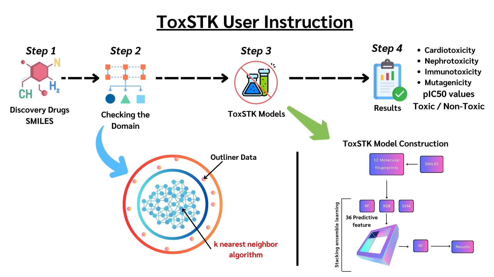

# Under review in Computers in Biology and Medicine Journal.
# ToxSTK: A Multi-Target Toxicity Assessment Utilizing Molecular Structure and Stacking Ensemble Learning.


## Surapong Boonsom ,Panisara Chamnansil ,Sarote Boonseng ,Tarapong Srisongkram


## This repository contains software of ToxSTK

#### Download necessary packages
```
!pip install pandas numpy joblib padelpy
!pip install scikit-learn==1.5.0
!pip install xgboost==2.1.1
```
#### Clone this and updated this repository as needed
```
!git clone https://github.com/taraponglab/toxstk_software.git
```

#### Check the file in your system
```
%ls
```
#### Add you molecule and SMILES in app.csv file. Then run the classification and regression models.
```
python classification.py
```
#### Then, you will get this result from the your terminal.
```
# Classification
      hERG_class     AD_hERG  mTOR_class    AD_mTOR  PBMCs_class   AD_PBMCs  Ames_class    AD_Ames
Name                                                                                              
Mol1           0  outside_AD           1  within_AD            0  within_AD           0  within_AD
```
#### Then run the regression model.
```
python regression.py
```
#### Then, you will get this result from the your terminal.
```
# Regression
      hERG_pIC50     AD_hERG  mTOR_pIC50     AD_mTOR  PBMCs_pIC50    AD_PBMCs
Name                                                                         
Mol1     5.77729  outside_AD    5.997419  outside_AD     4.709869  outside_AD
```
#### Interpretation

**class** = Toxicity class, where 1 = toxic and 0 = non-toxic
**pIC50** = Toxicity potency, where a higher number is the greater toxic.
**AD_status** = Prediction is within or outside AD


## Version
ToxSTK version 1.0

## Cite
Under review. You can download full text on pre-print server: Boonsom S, Chamnansil P, Boonseng S, Srisongkram T. ToxSTK: A Multi-Target Toxicity Assessment Utilizing Molecular Structure and Stacking Ensemble Learning. ChemRxiv. 2024; doi:10.26434/chemrxiv-2024-7grvl This content is a preprint and has not been peer-reviewed.

## MIT Licence

Copyright (c) [2024] [Dr.Tarapong Srisongram]

Permission is hereby granted, free of charge, to any person obtaining a copy
of this software and associated documentation files (the "Software"), to deal
in the Software without restriction, including the rights to use, copy, modify,
merge, publish, distribute, sublicense, and/or sell copies of the Software,
and to permit persons to whom the Software is furnished to do so, subject to
the following conditions:

The above copyright notice and this permission notice shall be included in
all copies or substantial portions of the Software.

THE SOFTWARE IS PROVIDED "AS IS", WITHOUT WARRANTY OF ANY KIND, EXPRESS OR
IMPLIED, INCLUDING BUT NOT LIMITED TO THE WARRANTIES OF MERCHANTABILITY,
FITNESS FOR A PARTICULAR PURPOSE AND NONINFRINGEMENT. IN NO EVENT SHALL THE
AUTHORS OR COPYRIGHT HOLDERS BE LIABLE FOR ANY CLAIM, DAMAGES OR OTHER
LIABILITY, WHETHER IN AN ACTION OF CONTRACT, TORT OR OTHERWISE, ARISING FROM,
OUT OF OR IN CONNECTION WITH THE SOFTWARE OR THE USE OR OTHER DEALINGS IN THE
SOFTWARE.
